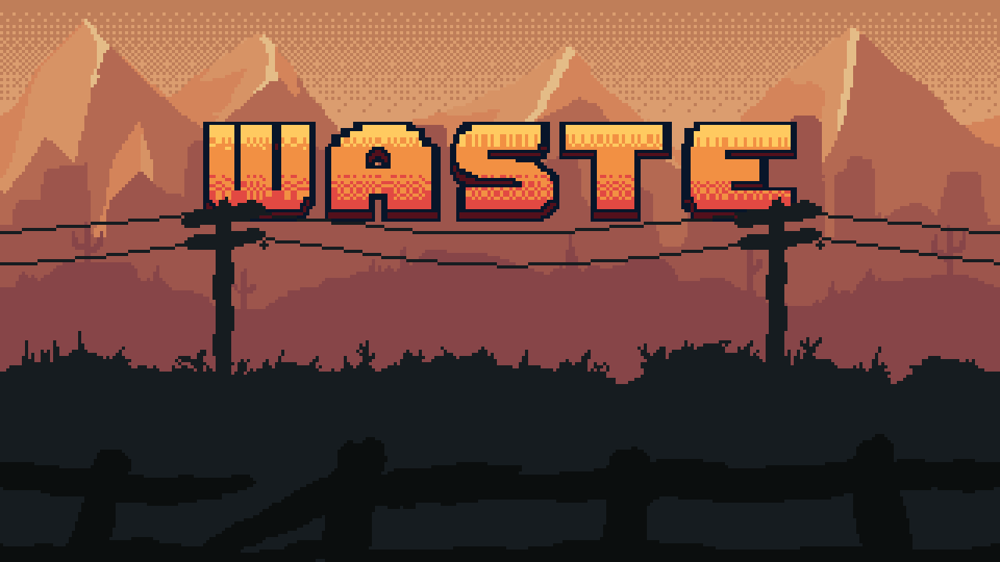

# Waste

Welcome to the Wastes, traveler! It's been 40 years since the Wasting began, and 
the landscape shows it on its face. What was once a thriving environment is now covered in 
nothing but sand, mud, and the radioactive creatures that replaced the bustling life here.

Some people have learned to thrive in the Wastes, happily coexisting with these creatures, and some have gone even further to profit off of the chaos, and train monsters to enforce their will. In your travels, you have learned that there is a source of the Wasting, a chunk of an extremely radioactive isotope of Cesium, Cs-137, from a meteor that struck Earth before the Wasting started. However, several profiteers split this chunk into parts and protect each part to keep the Wasting active. Five chunks lay around the Wastes, well-guarded by many monsters, both wild and trained. You, traveler, must find and destroy these chunks, defeat their guardians, and end the Wasting, bringing life back to the Wastes.

# How to Play

## Singleplayer

When the game launches, you're faced with the start menu, which has buttons to start a single-player game, play multiplayer, view help, or view credits. 

In single-player, you control a player sprite in a top-down 2D map of the Wastes. This map 
is procedurally generated as the player moves around using [Wave Function Collapse](https://github.com/mxgmn/WaveFunctionCollapse). To move the player, use the `WASD` keys.

While in the overworld, you can press `G` to see your game progress (including level, bosses defeated, and number of active quests), `I` to see your item inventory, `P` to see how 
many monsters you have collected so far, `C` to see your coordinates in the world, and `Esc` to pause the game (from which point you can quit to desktop). 

As you move around the world, you may see several kinds of special tiles. Firstly, a tile that looks like a chest contains an item, either healing or strength-buffing, which you can collect by colliding with the tile. A tile with a floating heart on it will heal your whole monster party, and a tile with crabs on it represents a monster you can battle. Additionally, there are several character sprites around the world that represent other travelers or residents of the Wastes. Colliding with these characters will assign you a new quest, where if you defeat a monster of a specific type you will receive a reward in the form of some number of items. 

### Monster Types

Monsters that you collect and battle have types, or Elements, representing the natural habitat and structure of the creature. These elements are as follows:

- **Scav**: Scavenger type
- **Growth**: Plant/nature type
- **Ember**: Fire type
- **Flood**: Water type
- **Rad**: Radioactive type
- **Robot**: Robot type
- **Clean**: Sterile type
- **Filth**: Slime type

Each of these monster types have unique strengths and weaknesses when faced against other monsters, which should influence your decision to flee or fight. Each monster can do a base attack, but also has an elemental attack which incorporates a damage modifier based on its own type and the type of the target, as well as a special multi-move which chains an elemental attack together with a base attack for potentially massive damage. When an elemental or special attack occurs, the following damage multipliers are applied (row: attacking, column: target):

|            | Scav | Growth | Ember | Flood | Rad | Robot | Clean | Filth |
|------------|:----:|:------:|:-----:|:-----:|:---:|:-----:|:-----:|:-----:|
| **Scav**   | 1.0  |  2.0   |  0.5  |  2.0  | 0.5 |  1.0  |  0.5  |  0.5  |
| **Growth** | 1.0  |  1.0   |  0.5  |  2.0  | 2.0 |  2.0  |  0.5  |  0.5  |
| **Ember**  | 2.0  |  2.0   |  1.0  |  0.5  | 2.0 |  0.5  |  1.0  |  0.5  |
| **Flood**  | 1.0  |  0.5   |  2.0  |  1.0  | 0.5 |  2.0  |  2.0  |  2.0  |
| **Rad**    | 2.0  |  0.5   |  1.0  |  1.0  | 0.5 |  0.5  |  2.0  |  1.0  |
| **Robot**  | 2.0  |  0.5   |  1.0  |  0.5  | 2.0 |  1.0  |  0.5  |  2.0  |
| **Clean**  | 0.5  |  1.0   |  2.0  |  0.5  | 1.0 |  0.5  |  1.0  |  2.0  |
| **Filth**  | 2.0  |  1.0   |  0.5  |  1.0  | 1.0 |  2.0  |  2.0  |  0.5  |

Part of the goal of the game is to learn which monsters are best suited to fight other monsters and to use this to your advantage, especially when fighting bosses, which have much higher health than normal enemies. 

### Singleplayer Battles

Once you have collided with a crab tile, a battle will begin. Your screen will transition to a battle background containing your monster on the left and the enemy monster on the right, with the corresponding monster HP and level displayed above these monsters. 

Battles are turn based: you choose an action, and the enemy responds. In singleplayer, you have the advantage: you always get to take the first turn. Let's cover what your options are:

- **Attack**: Press the `A` key to deal a base damage attack. Your monster's base attack damage depends on its level.
- **Defend**: Press the `D` key to defend. Defending wastes your turn, but prevents damage from being inflicted on your monster. 
- **Elemental Attack**: Press the `E` key to deal an elemental attack, which multiplies your base damage by the appropriate modifier. Use this if your monster is strong against the other monster, but not if your monster is weak to it, or else it will deal less damage than a normal base attack!
- **Multi-move**: Press the `S` key to do a special chained move. This will deal elemental attack damage plus base damage, all as one move (meaning the enemy will not be able to react in between). This move can **only be used twice per battle,** so choose which monsters to use it with carefully!
- **Use a Heal Item**: Press the `1` key to use a heal item if any are available in your inventory. Careful, item usage counts as a turn, and an enemy can choose to attack you.
- **Use a Buff Item**: Press the `2` key to use a strength buff item, which will increase your damage across all attacks for your next five turns. 
- **Switch Monsters**: Press `C` to cycle through your monster party, choosing one whose strengths best fit your current opponent.
- **Flee**: Press `Q` to quit the battle early and flee. This will not heal your monsters or replenish any items, but gives you the chance to escape and find a healing tile.

*Note: all attacks have the chance to crit, dealing bonus damage!*

Upon reducing an enemy's health to 0, you will win the battle and your party will level up. Leveling up heals your monsters and increases their base HP and damage. It also moves you closer to facing bosses, which will appear every five levels you attain.

Upon an enemy reducing all of your monster's HP to 0, you will be defeated. Don't worry! The game isn't over, you need to find a heart tile to heal all of your monsters up before being able to battle again. 

Once a crab tile has been activated in a battle, the monster leaves (it has either been defeated by you, or moved on if you fled). That means that the same tile can never be activated again, so you'll have to look through the infinite world to find more monsters to fight. 

### Bosses
Every five levels, you will face a boss. Bosses come with extra health and damage, so be ready for a real fight. Boss battles work the same way as normal battles, except that you will need to put more effort into using your items and elemental modifiers to succeed. 

### Travelers and Quests

When a boss is defeated, a traveler will come to greet you. Speaking to the traveler (by colliding with the sprite) will give you a quest. In addition to these travelers, several residents of the wastes spawn into the map at **fixed locations** to give you quests to get started. Talk to these residents if you see them before you start any battles, as your battles may result in a quest reward!

Quests have a **target** and a **reward**. The target is a monster type, and if you defeat a monster of that type, you will fulfill the quest. The reward consists of an item type, either healing or strength-buffing, and an amount of that item to be given. 

Upon completing a quest, you gain the amount of whichever item type is the reward instantly—you don't need to return to the place the quest was given. 

### Beating the Game

Defeating 5 bosses will end the game, and roll credits. At this time, the game ends and you are sent back to the main menu if you press escape.*

\**In select situations, the game may crash if trying to restart after finishing a previous run. If this occurs, just re-open the game. The game has no save mechanic, so no data was lost, and the crashing error will not persist.*

## Multiplayer

Multiplayer is tw-person, peer-to-peer, and LAN-based, and has two primary modes: Player-versus-Player (PvP) and Player-versus-Enemy (PvE). 

### Setting up a Game
To start, one player will have to decide to host a game. In the multiplayer menu, host a game with either the "host pvp game" or "host pve game" buttons. The game terminal will print the address and port which it has bound to (normally, this is your local address and port 9800 or 8081, but is subject to change depending on available ports). The game host should then give this address and port to the other player who wants to connect. The connecting player should click one of the "join ___ game" buttons, corresponding to whichever mode the host selected. They will then be prompted in their terminal to input the address and then port to connect to, and then a connection will be established and the appropriate mode will be initialized on both player's screens.

### PvP Mode
In PvP mode, the two players fight one another. Since there was no opportunity to collect monsters (as there is no overworld in multiplayer), each player is given a random monster with the stats of a level 10 monster in singleplayer. Like singleplayer, this game mode is turn based, and so the host takes their turn first. Each player is not shown the other's action until the turn is calculated, to prevent one user from being able to counter all of the other user's special moves. Besides for this, the same actions from singleplayer are available here, including item usage, as each player starts with a few of each item type. Once each player has chosen an action, the turn results will be calculated and applied to each player's monster, updating their screens.

The first player to reduce the other's to 0 HP wins, and if both are reduced to 0 HP in one turn, a draw occurs.

### PvE Mode
In PvE mode, the two players fight together against a boss monster. Since there are now two players who can cooperate, this boss is extra difficult. Once the boss's HP is reduced to 0, the players win. If **either player's** HP is reduced to 0, **both players lose**. This means you must strategize and cooperate closely with your friend to defeat the boss. 

In this game mode, the host chooses their action first, then the client chooses an action, and the boss decides how to react based on the information provided to it. The host and client damage will be aggregated to apply to the boss, and the boss can either attack one player (to try to reduce their health to 0 quickly) or do an AoE attack if it thinks that the likelihood of defeating either player is equal. 

This game mode has the same actions as PvP and singleplayer except that each player is given a few extra items and special move slots, and it also introduces a new mechanic: *trading*.

### Trading
There are two types of trading in PvE battles: monster trading and item trading.

**Monster trading** is one-way in a single trade, but both players can trade monsters to the other. To trade a monster to your friend, press the `M` key. In a trade, the giving player sends their monster to the recipient, who replaces their own monster with that one, and the giving player regenerates a new monster to use. This regeneration is random, meaning **players can use the trading system to try and draft good monsters** so that each player has a strong monster to face the boss. For example, if one player has a monster which is strong to the boss, and another has one that is weak to the boss, it may be a discussion as to whether the player with the stronger monster wants to take the chance of drawing a weak monster to give their friend a better one, or hope that they draw a strong or at least neutral monster, in which case the players are now in a net positive state. 

Monster trading can occur **only before any other action types are taken by either user.** That means that if either player chooses to attack or trade items, the battle begins. This is important, you must decide on the monsters you want to play with before the battle truly begins, so work together and communicate to decide the best monsters to face the boss!

**Item trading** occurs as a turn action, meaning it consumes your turn once a battle has actually begun. To trade a healing item to your friend, press the `3` key. To trade a buff item to your friend, press the `4` key. 

Trading requires that you have at least one of the item you'd like to send in your inventory, and will deduct that item from your inventory in order to give it to your teammate. Use trading to help your friend when they're running low on HP (which will cause the boss to target them aggressively) or to give them extra damage if they are strong against the boss as is. Working together and communicating is key to beating the boss.

# Credits
This game was developed as a semester project for CS1666 at the University of Pittsburgh, taught by [Dr. Nicholas Farnan](https://github.com/nfarnan), by:

- [Caela Go](https://github.com/cmgo412)
- [Cam Simons](https://github.com/camrynsimons)
- [Chase Bradley](https://github.com/clb234)
- [Chris Hinson](https://github.com/chris-hinson)
- [Dan Li](https://github.com/til61)
- [Gavin Heinrichs-Majetich](https://github.com/Elsklivet)
- [Nathan Meyers](https://github.com/NMM103)
- [Prateek Jukalkar](https://github.com/psdev30)
